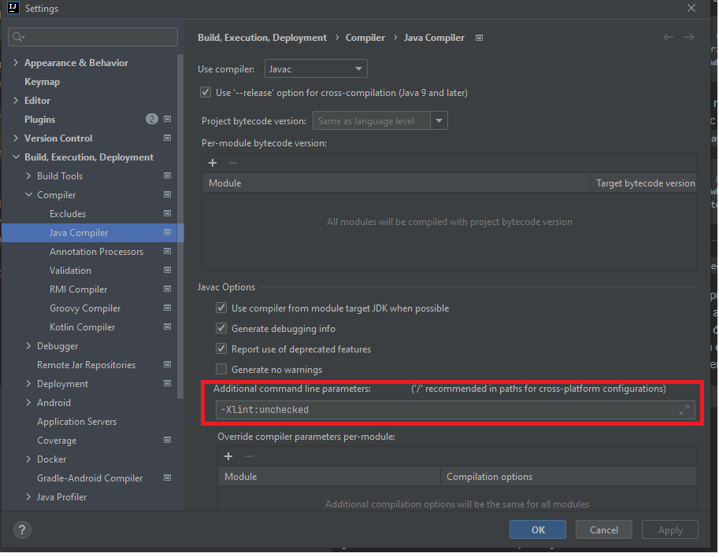
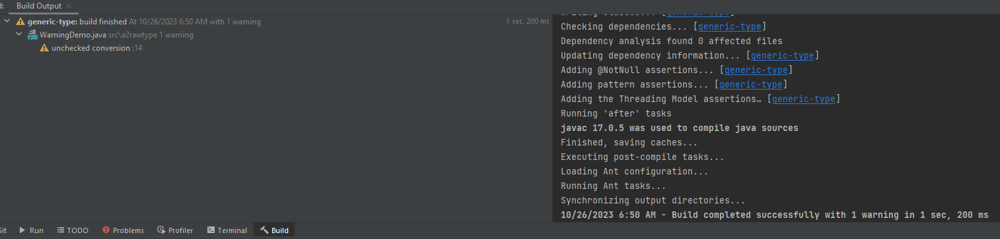

Ở phần trước chúng ta đã biết [generic type](../a1generictype) là gì, bài này sẽ bổ sung thêm một chút về khái niệm `raw type`.
***
Một `raw type` là tên của một generic type (generic class or interface) mà không có bất kỳ kiểu tham số nào.

Ví dụ một generic type:
```java
public class Box <T>{
    private T t;
    public void set(T t) {
        this.t = t;
    }
    public T get() {
        return t;
    }
}
```
Đây là một generic type, chúng ta có thể khởi tạo đối tượng kiểu `raw type` bằng cách bỏ qua truyền tham số cho `generic type`, sau đó có thể tuỳ ý quyết định Box này chứa kiểu nào như sau:
```java
Box rawBox = new Box();
rawBox.set(1);
System.out.println(rawBox.get());
```
- rawBox có kiểu `raw type`
- set giá trị kiểu bất kì cho box, ở trên mình minh hoạ với kiểu Integer

Như vậy `Box()` là `raw type` của `generic type Box<T>`, tuy nhiên một non-generic class or interface không phải là một `raw type`. 
***
*Chú ý*
- Việc gán parameterized type cho kiểu raw type là được phép
```java
// gán raw type = parameterized type
Box<String> stringBox1 = new Box<>();
Box rawBox1 = stringBox1;
```
- Làm ngược lại sẽ nhận cảnh báo, khi chỉ con trỏ chuột vào `rawbox2` sẽ nhận được message `Unchecked assignment: 'a2rawtype.Box' to 'a2rawtype.Box<java.lang.Integer>' `
```java
// gán parameterized type = raw type => warning unchecked conversion
Box rawbox2 = new Box();
Box<Integer> intBox2 = rawbox2;
```
***
`unchecked`:
- compiler không đủ thông tin kiểu để thực hiện các kiểm tra kiểu cần thiết nhằm mục đích an toàn cho kiểu
- mặc định `unchecked` warning bị tắt, tuy nhiên Intellij Idea vẫn đưa ra hint bằng cách đưa con trỏ chuột vào biến đó như đã làm ở trên
- để xem tất cả unchecked warnings: thêm `-Xlint:unchecked` như sau

khi đó tại thẻ build sẽ hiển thị tất cả các unchecked warnings

- để tắt hoàn toàn bổ sung thêm `@SuppressWarnings("unchecked")` vào đầu class `WarningDemo`, khi chỉ vào biến sẽ không hiện warning nữa.
