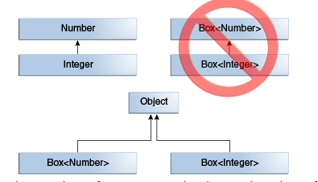
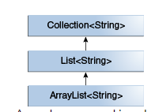
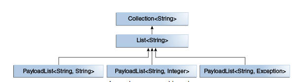

Các `class` có mối quan hệ `extends` với nhau hoặc mối quan hệ `implement` với `interface` sẽ tồn tại khái niệm `subtype`
- Tất cả các kiểu trong Java đều là subtype của Object type

Việc ép kiểu như sau: kiểu của con về kiểu của cha là hoàn toàn hợp lý. Integer là subtype của Object
```java
Object someObject = new Object();
Integer someInteger = new Integer(10);
someObject = someInteger;   // OK
```
- Trong hướng đối tượng còn có khái niệm "is-a" relationship: paren  "là một" child, khi chúng ta đùng kiểu của cha để khởi tạo các đối tượng con, tăng tính linh hoạt của code
- Việc tương thích kiểu theo mối quan hệ này cũng được thể hiện trong generic

```java
public void someMethod(Number n) { /* ... */ }

someMethod(new Integer(10));   // OK
someMethod(new Double(10.1));   // OK
```
Vì Integer, Double kế thừa từ Number do vậy nó là subtype, việc gán subtype bằng parent là hoàn toàn hợp lệ như đã nói ở trên nên ta truyền giá trị kiểu Integer hoặc Double sẽ không báo lỗi

tuy nhiên với:
```java
public void boxTest(Box<Number> n) { /* ... */ }
```
nếu truyền Box<Integer>, Box<Double> sẽ báo lỗi ngay vì Box<Integer>, Box<Double> không phải là subtype của Box<Number>



*kết luận*:
- Với hai concrete type A và B và hai generic type `MyClass<A>`, `MyClass<B>` thì `MyClass<A>` và `MyClass<B>` sẽ không có mối quan hệ nào với nhau bất kể A và B có là gì với nhau đi chẳng nữa
***
Trên thực việc ứng dụng subtype và generic class được sử dụng khá nhiều trong Collection
Ví dụ với `List<String>`


- với các subtype, miễn là không thay đổi type argument thì mối quan hệ được bảo tồn

Đối với multiple type parameter
```java
interface PayloadList<E,P> extends List<E> {
  void setPayload(int index, P val);
  ...
}
```
PayloadList <E, P> là subtype của List<E>



